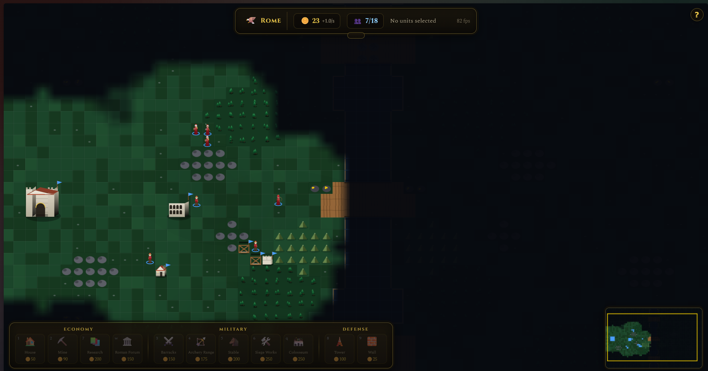
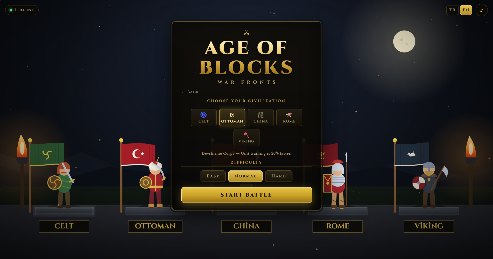
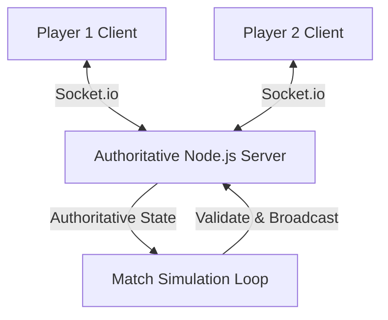

# ⚔️ Age of Blocks

<div align="center">
  
  <br/><br/>
  
  
  <p align="center">
    <strong>A minimalist, browser-based, real-time strategy and territory conquest game.</strong>
  </p>

  <p align="center">
    <a href="https://ageofblocks.games"><strong>👉 Play Now in Your Browser! (ageofblocks.games) 👈</strong></a>
  </p>

  <p align="center">
    
    
    
    
  </p>
</div>

---

## 🎮 About the Game

**Age of Blocks** combines classic real-time strategy (RTS) mechanics with a minimalist, block-focused design. There are no heavy downloads or complex menus; you can jump straight into tactical battles right from your browser. 

* **Multiplayer Lobby**: Create public rooms or join active lobbies instantly from the lobby list—no room codes needed.
* **Authoritative Server**: Full anti-cheat protection. Clients only send commands, and the server validates and simulates all movements, combat, and resource gathering.
* **Localization**: Fully localized in English and Turkish, auto-detected from your browser language and persistent via local storage.

---

## ✨ Key Features

- **🎮 Instant Play**: Zero installation. Built using HTML5 Canvas, modern CSS, and lightweight client assets.
- **🛡️ Tactical Conquest**: Place blocks strategically, secure your borders, and push deep into enemy territories.
- **💰 Resource & Economy Management**: Capture neutral or enemy blocks to expand your economy. Balance construction, defense, and army building.
- **🔊 Dynamic Audio**: Atmospheric soundscapes and immersive combat sound effects filtered based on fog-of-war (you only hear action within your visibility).
- **🎨 Premium Visuals**: Dark-mode aesthetic, customized typography (Cinzel & Spectral), and fluid CSS micro-animations.

---

## 🛠️ Architecture & Tech Stack

The game is designed with a modern multiplayer architecture:



### Technical Details:
- **Client**: Vite, TypeScript, HTML5 Canvas, Vanilla CSS.
- **Server**: Node.js, Socket.io, TypeScript (`tsx`).
- **Deployment**: Nginx (reverse proxy serving static `dist/` files) + PM2 (node process manager running the authoritative match server) on a DigitalOcean Droplet.

---

## 🚀 Deployment Guide

We use a two-part deployment system to deploy changes from your local Windows machine straight to the live Ubuntu droplet.

### 1. Remote Server Setup
The server is configured with a `scripts/deploy.sh` script that automates pulling the latest code from GitHub, building the client, and restarting the services.

To run the deployment script directly on the droplet:
```bash
bash /var/www/age-of-blocks/scripts/deploy.sh
```

### 2. Automatic One-Click Local Deploy
We have a local PowerShell utility script to automate pushing to GitHub and executing the remote deploy script via SSH in one command:

```powershell
# Run the local deploy script
.\scripts\deploy-remote.ps1
```

*Note: The script automatically authenticates with the remote server using the configured credentials, performs `git push origin main`, pulls the changes on the server, runs `npm ci` / `npm run build`, and restarts the server using `pm2 restart`.*

---

## 🤝 Contributing

To contribute to the project, set up your local development environment, and learn about our coding standards, please check the **[Contributing Guide (CONTRIBUTING.md)](CONTRIBUTING.md)**.

---

## 📄 License & Credits

Copyright © 2026 Huseyin Enes ERTURK. All rights reserved.

The source code and assets of **Age of Blocks** are proprietary. However, you are permitted to fork, copy, and modify the code solely for the purpose of submitting contributions (Pull Requests) back to this repository. Copying, distributing, modifying, or using the code for any other purpose, particularly commercial applications, without explicit permission is strictly prohibited.
